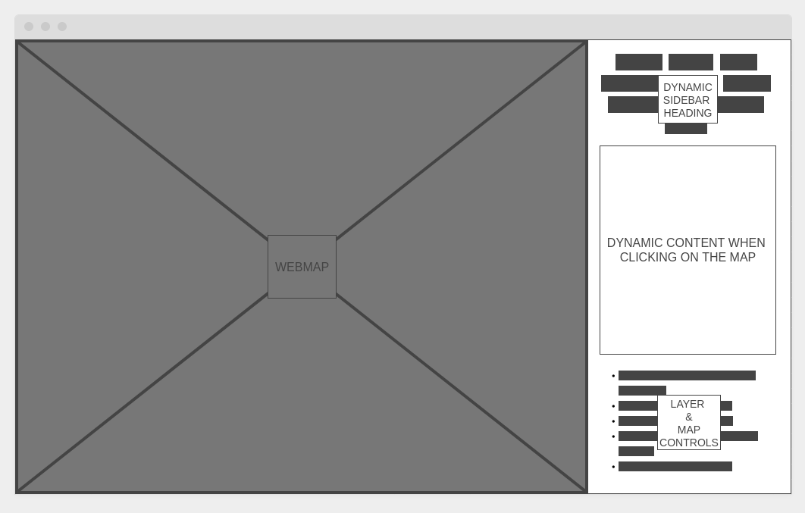

# IssueTrac Project

Welcome to the Issue Trac project. 

Issue Trac a simple GIS based issue reporting and work management system. The general premise for the applications is to 
provide a web based map which allows a visitor to _"click"_ a location and report an issue or problem. These spatially 
enable locations offers an ability to present the reporting person(s) geo-specific, nomenclature work types and 
categories. All reported issue are associated with a maintaining agency at the state, county and 
city levels. 

## Project Components 

The project is organized into different repositories with each encompassing a specific area of the applications' 
development. Brief descriptions and links to those project repositories are found below:

- [nasumilu/issue-trac-databasse (a.k.a. IssueTrac Database)](https://github.com/nasumilu/issue-trac-databsase) project 
  contains all things database which is associated with the application. This includes entity relationship diagrams 
  (ERD), set-up sql and scripts, and any initial application data.

- [nasumilu/feature-server](https://github.com/nasumilu/feature-server) is an application which provides discrete 
  feature information is a standard way. The application will adhere to the minimum standards outlined by the 
  Open Geospatial Consortium (OGC) [Feature - OGC API standard](https://docs.opengeospatial.org/is/17-069r4/17-069r4.html).

- [nasumilu/issue-trac (a.k.a. IssueTrac API)](https://github.com/nasumilu/issue-trac-api) is the actual issue 
  tracking/work management applications that will provide the necessary application programming interface (API) to create, 
  read, and update issues by providing an interface between application, database(s), and other **backend** web services.

- [nasumilu/issue-trac-web (a.k.a. IssueTrac Web)](https://github.com/nasumilu/issue-trac-web) is a single page 
  application (SPA) which gives a face to the IssueTrac API. 

## User Stories

1. A citizen is walking on a sidewalk and notice a large crack in the surface. The section of sidewalk is heaved upwards
   creating a tripping hazard and wishes to report the issue, an image(s) and location immediately to the appropriate
   maintaining agency. 

2. A city manager wants better engagement with its residents when requesting maintenance services. The manager wants to
   give citizens and staff the ability to communicate upon specific issues throughout its lifecycle.

3. A resident notice the litter in the neighborhood park has not picked up despite reporting the issue over a week 
   ago. The person can look at the status (lifecycle) of their issue and leave additional comments and/or photos.

4. Maintenance staff is able to identify issues spatially, by category, and engagement to prioritize resource. Providing
   the best maintenance service possible.

5. Maintenance staff may evaluate location and types of issues to identify reoccurring problems through spatial analysis
   to optimize, budget, and plan maintenance efforts.

## Use Cases

1. A citizen can load a web map on a mobile device and report an issue. The location of the issue is reported using the 
   devices GPS location. Otherwise, the citizen is allowed to freely choose the location of the issue. Once, chosen this 
   person must select a category which best describes the _thing_ having an issue and a sub-category that describes the 
   nature of the issue. (e.g. road, pothole or park, litter). A set of general, default categories and subcategories 
   will be provided but geo-specific categories and locations MUST be provided. The information gather is stored in the
   application database.

2. The web application will utilize the devices' location, when enabled to set the initial view of the web map. If the 
   location is not available, a request to the feature server to obtain the best guess location from the devices IP
   address (GeoIP). The web-map once recipient the location will asynchronously load the base map and open issues located
   with in the maps viewing extent. Citizens can select, view, and add comments/media to any existing issue.

3. The citizen clicks on a point in the web map. The application, shall send a request to the feature service to obtain
   all the geographic jurisdictions which intersects the point. That information is present to the user. If multiple 
   jurisdictions are found, they will be presented to the user to select the appropriate maintaining agency. The user 
   may select an issue category and type (sub-category), leave brief title and optional description and media.

4. A member of the city's maintenance staff is patching potholes on the far side of the city limits. This maintenance
   work is responsible for checking for any newly reported issues which might be within the work area. This worker will
   utilize the app to locate, assign, and optionally comment towards resolving the issue.

5. The jurisdiction's civil engineer is developing a five-year work/project plan. This engineer will use archived issues
   and location to spatially analyze "hot-spot" locations. Since the issues, are published as an OGC API Feature,
   compliant applications can ingest the information for complex analysis.

## Application Wireframe

## Resources
- [Dia Diagram Editor](http://dia-installer.de/) an opensource UML editor
- [Wireframe.css](https://wireframe.cc/) an online service for creating wireframes
- [GIMP](https://www.gimp.org/) an opensource image manipulation program
- [JetBrains Suite](https://www.jetbrains.com/)
  - [IntelliJ IDEA](https://www.jetbrains.com/idea/) a commercial Java & Kotlin IDE
  - [PhpStorm](https://www.jetbrains.com/phpstorm/) a commercial Php IDE
  - [DataGrip](https://www.jetbrains.com/datagrip/) a commercial IDE for SQL development
  - [WebStorm](https://www.jetbrains.com/webstorm/) a commercial IDE for html, css, javascript, and typescript

## Technologies
- Programming Languages
  - [Java](https://www.java.com/en/) high-level object-oriented programming language
  - [PHP](https://www.php.net/) a general purpose scripting language suite for the web
  - [TypeScript](https://www.typescriptlang.org/) a strongly typed language which builds javascript
  - [Bash][https://www.gnu.org/software/bash/] Bourn Again SHell
  - SQL & [PlpgSQL](https://www.postgresql.org/docs/current/plpgsql.html) SQL and a procedural programming language for PostgreSQL
  - HTML, CSS, & [Sass](https://sass-lang.com/)
  
- Frameworks
  - [Angular](https://angular.io/) web development framework for creating single page application
  - [Spring](https://spring.io/) Many things, but in this projects context a Java backend framework
  - [Symfony](https://symfony.com/) A Php framework web, cli, etc.
  - [Bootstrap](https://getbootstrap.com/) web frontend toolkit 
  - [OpenLayers](https://openlayers.org/) A javascript library for creating dynamic maps on the web
  - [Leaflet](https://leafletjs.com/) lightweight javascript library for making interactive maps
  - [Hotwire Stimulus](https://stimulus.hotwired.dev/) javascript framework
  - [MySQL](https://www.mysql.com/) an opensource relational database
  - [PostgreSQL](https://www.postgresql.org/) an opensource object-relational database
  - [PostGIS](https://postgis.net/) a spatial database extender for PostgreSQL
  - [ogr2ogr](https://gdal.org/programs/ogr2ogr.html) a [GDAL](https://gdal.org/) utility for converting simple feature between formats